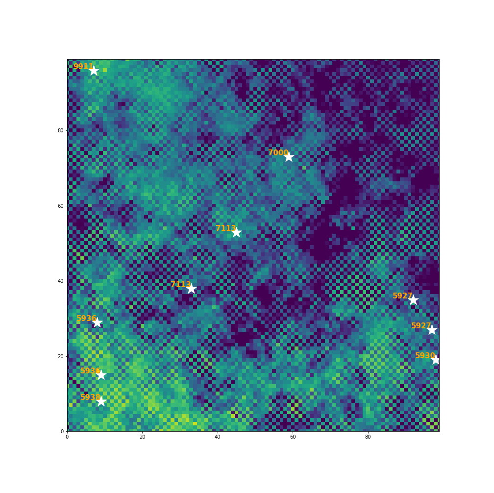

## Assignment 1: Agent-Based Model

For the first assignment from the Leeds University module *Programming for Social Scientists: Core Skills*, I had to create an Agent-Based Model (ABM).
The ABM simulates the randomised movement of sheep eating grass in the field, with the grass being the environment.

Within the ABM, the following variables can be altered as required:
- num_of_iterations (the number of times the animation loops)
- num_of_agents     (the number of sheep)
- neighbourhood     (how close the agents can be together)

  

The ABM displays a number next to each agent; this number represents the agents current store of food (i.e. grass). 
The agents share their food storage when within a certain distance away (defined by **neighbourhood** value). 
You can observe this by watching their annotated store numbers becoming the same with any nearby Agents.

The ABM is designed to continue until a stopping condition is met. This condition has been set to when the environment has been emptied.
The quickest way to test this is to set the *num_of_iterations* to a large number (e.g. 1000) and wait for the environment to turn a dark blue. The agents will stop moving and *Stopping condition* will be seen in the IPython console.

To view the coding, click [here](https://github.com/sianteesdale/ABM-Assignment-1) to see the relevant repository. 
